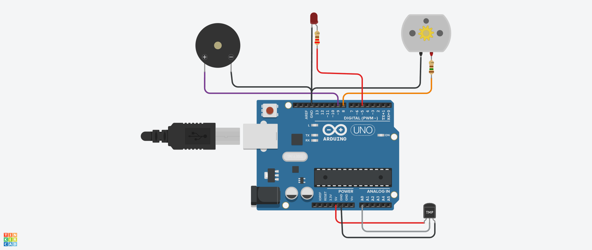
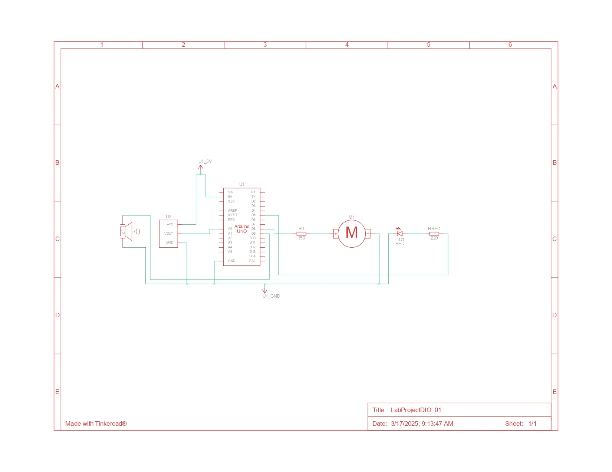

# Lab Project 01
### Electronic Circuit Project - IoT

#### Project Proposal
In this project, simulating a vegetable greenhouse, an electronic circuit must be developed in the TinkerCad simulator (https://www.tinkercad.com/) involving a temperature sensor, a buzzer, an LED and a motor, controlled by an Arduino. The project must follow the following functionality:

(a) Read the temperature;

(b) Activate a fan motor if the temperature is equal to or greater than 30 °C;

(c) If the temperature exceeds 50 °C, a red LED and a buzzer must be activated, warning of an emergency situation.

The entire process described must be programmed in C language on the Arduino project board.

### Project Details

#### Assembly Image

#### Electrical Drawning

#### Component List

| Name   | Quantity | Component                  |
| ------ | -------- | -------------------------- |
| U1     | 1        | Arduino Uno R3             |
| U2     | 1        | Temperature Sensor TMP36   |
| PIEZO1 | 1        | Piezo (Buzzer)             |
| M1     | 1        | DC Motor                   |
| R1     | 1        | 150 Ω Resistor             |
| Rred   | 1        | 220 Ω Resistor             |
| D1     | 1        | Red LED                    |

